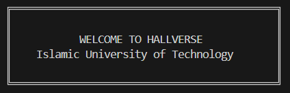
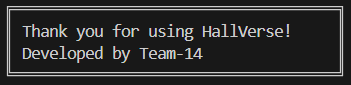

## PROJECT NAME
HallVerse - A Console-based Hall Management System

## OVERVIEW
<p align="center">
  
</p>
HallVerse is a C++ based hall management system that manages student information, room allocation, payment status, complaints, and other administrative tasks through a simple, menu-driven interface. It focuses on secure data handling using CSV files, organized record-keeping and smooth user interaction.

## KEY FEATURES
**User Authentication System** <br>
The system provides secure username and password-based authentication for both Students and Admin. It ensures role-based acccess control, allowing users to access only authorized features. A password reset feature is also included to maintain account security. <br>

Student login:
- Username: STUDENT ID (e.g. 230042100)
- Password: password (Students can change their password after logging in)

Admin login:
- Username: A*** (A001 - A003)
- Password: admin

**Student Features** <br>
Profile Management:
- Students can view their profile details
- Students can update their email and emergency contact

Complaint Management:
- Students can file a complaint based on different categories (Electricity, plumbing, housekeeping, internet etc.)
- Students can view their own complaints along with the status

Log Entry/Exit Management:
- Students can log their entry/exit from the hall
- Each log is recorded with exact date and time and can be monitored by the admin

**Admin Features** <br>
From Dashboard admin can view: <br>
- Total Students
- Total pending dues
- Total Complaints (pending/in-progress/resolved)
- Total Entry/Exit

Student Management:
- Admin can view all students
- Admin can add new students
- Admin can remove a student
- Admin can verify students payment (clear dues)

Complaint Management:
- Admin can view all complaints

## FOLDER STRUCTURE
HallVerse/ <br>
│ <br>
├── src/ <br>
│   ├── main/ <br>
│   │   ├── Main.cpp <br>
│   │   └── App.cpp <br>
│   │ <br>
│   ├── models/ <br>
│   │   ├── Student.h <br>
│   │   ├── Student.cpp <br>
│   │   ├── Admin.h <br>
│   │   ├── Admin.cpp <br>
│   │   ├── Complaint.h <br>
│   │   ├── Complaint.cpp <br>
│   │   ├── Worker.h <br>
│   │   ├── Worker.cpp <br>
│   │   ├── WorkAssignment.h <br>
│   │   ├── WorkAssignment.cpp <br>
│   │   ├── EntryExitRecord.h <br>
│   │   └── EntryExitRecord.cpp <br>
│   │ <br>
│   ├── managers/ <br>
│   │   ├── StudentManager.h <br>
│   │   ├── StudentManager.cpp <br>
│   │   ├── ComplaintManager.h <br>
│   │   ├── ComplaintManager.cpp <br>
│   │   ├── WorkerManager.h <br>
│   │   ├── WorkerManager.cpp <br>
│   │   ├── RoomManager.h <br>
│   │   ├── RoomManager.cpp <br>
│   │   ├── WorkAssignmentManager.h <br>
│   │   ├── WorkAssignmentManager.cpp <br>
│   │   ├── EntryExitManager.h <br>
│   │   ├── EntryExitManager.cpp <br>
│   │   ├── DashboardManager.h <br>
│   │   ├── DashboardManager.cpp <br>
│   │   ├── AuthenticationManager.h <br>
│   │   └── AuthenticationManager.cpp <br>
│   │ <br>
│   ├── services/ <br>
│   │   ├── FileHandler.h <br>
│   │   ├── FileHandler.cpp <br>
│   │   ├── Hasher.h <br>
│   │   └── Hasher.cpp <br>
│   │ <br>
│   └── utils/ <br>
│       ├── MenuPrinter.h <br>
│       ├── MenuPrinter.cpp <br>
│       ├── InputHelper.h <br>
│       ├── InputHelper.cpp <br>
│       ├── DateTimeHelper.h <br>
│       └── DateTimeHelper.cpp <br>
│ <br>
├── data/ <br>
│   ├── students.csv <br>
│   ├── admins.csv <br>
│   ├── complaints.csv <br>
│   ├── workers.csv <br>
│   ├── assignments.csv <br>
│   ├── rooms.csv <br>
│   └── entry_exit.csv <br>
│ <br>
├── build/ <br>
│   ├── HallVerse.exe <br>
│ <br>
└── README.md

## TO RUN THE APP
**Clone the Repository**
```bash
git clone https://github.com/didarulshahriar37/HallVerse.git
```
**Change Directory**
```bash
cd HallVerse
```
**Compilation**
```bash
g++ -std=c++17 -Isrc -Isrc/managers -Isrc/models -Isrc/services -Isrc/utils -O2 -g src/main/Main.cpp src/managers/*.cpp src/models/*.cpp src/services/*.cpp src/utils/*.cpp -o build/HallVerse.exe
```
**Run**
```bash
.\build\HallVerse.exe
```

<p align="center">
  
</p>

## CONTRIBUTORS
<a align="center" href="https://github.com/didarulshahriar37/HallVerse/graphs/contributors">
  
</a>